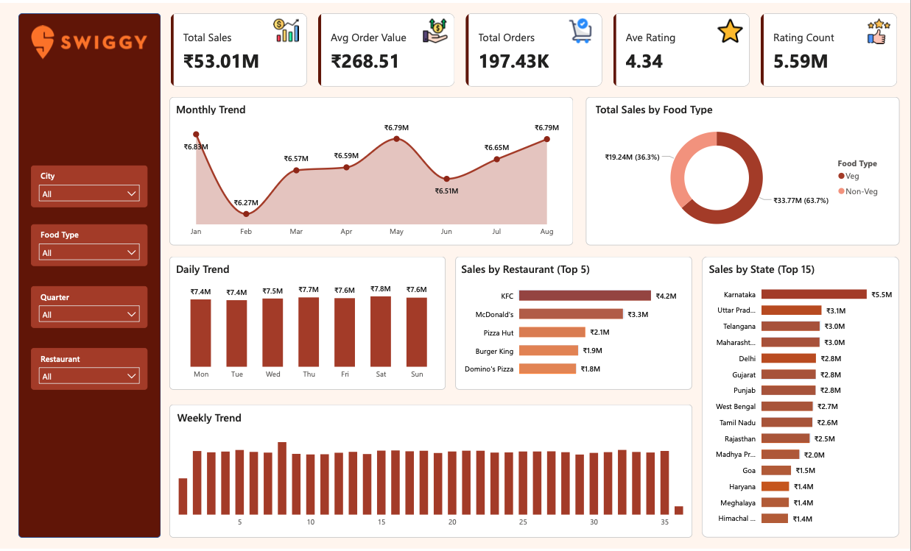

# 🍔 Swiggy Data Analytics Project

**End-to-End Data Pipeline using Microsoft Fabric, SQL & Power BI**

---

## 📌 Project Overview

This project simulates a real-world data analytics solution for a food delivery platform like Swiggy. It demonstrates how raw data is transformed into actionable business insights using **Microsoft Fabric, SQL, and Power BI**.

I built a complete **data pipeline**, starting from raw data ingestion to creating an interactive dashboard for stakeholders.

---

## 🎯 Business Objective

Swiggy generates large volumes of operational data from:

* Orders
* Restaurants
* Locations
* Ratings

The objective was to:

* Analyze business performance
* Identify top-performing restaurants and regions
* Understand customer trends
* Enable data-driven decision-making

---

## 🏗️ Architecture

Raw Data → Lakehouse → SQL Cleaning → Data Warehouse (Star Schema) → Power BI Dashboard

---

## 🛠️ Tech Stack

* **Microsoft Fabric**

  * Lakehouse (Data Storage)
  * Data Warehouse (Modeling)
* **SQL** (Data Cleaning & Analysis)
* **Power BI** (Visualization)
* **GitHub** (Version Control)

---

## 📊 Data Model

**Fact Table**

* `fact_orders`

**Dimension Tables**

* `dim_date`
* `dim_restaurant`
* `dim_dish`
* `dim_location`

---

## 📈 Key Business Insights

* 💰 Generated insights from **₹53M+ revenue**
* 🛒 Analyzed **197K+ orders**
* 💳 Calculated **₹268 Average Order Value**
* ⭐ Evaluated **5.5M+ customer ratings**

---

## 📊 Dashboard Insights

* Monthly & weekly sales trends
* Top-performing restaurants (KFC, McDonald's, etc.)
* State-wise revenue distribution
* Veg vs Non-Veg sales analysis
* Customer rating trends

---

## 📸 Dashboard Preview



---

## 🔍 SQL Analysis Highlights

* KPI calculations (Revenue, Orders, AOV)
* Time-based analysis (Monthly growth, daily trends)
* Restaurant performance analysis
* Location-based insights
* Product/category performance

### 🧠 Sample Query

```sql
SELECT
    ROUND(SUM(CAST(price AS DECIMAL(18,2))), 2) AS total_sales,
    COUNT(DISTINCT order_id) AS total_orders,
    ROUND(SUM(CAST(price AS DECIMAL(18,2))) 
    / NULLIF(COUNT(DISTINCT order_id), 0), 2) AS avg_order_value
FROM swiggy_project.fact_orders;
```

---

## 📂 Project Structure

```
Swiggy-Analytics-Project
│
├── data/
├── sql/
├── dashboard/
├── Business Requirement.docx
└── README.md
```

---

## 🚀 How to Run

1. Upload data to Fabric Lakehouse
2. Clean & transform using SQL
3. Build Star Schema in Warehouse
4. Create Power BI model
5. Build and publish dashboard

---

## 💡 Key Learnings

* End-to-end data pipeline design
* Star schema modeling
* Advanced SQL analytics
* Business KPI development
* Power BI dashboarding

---

## 🔗 Connect With Me

* 💼 LinkedIn: *https://www.linkedin.com/in/sadhanmistry*

---

⭐ If you like this project, give it a star!
